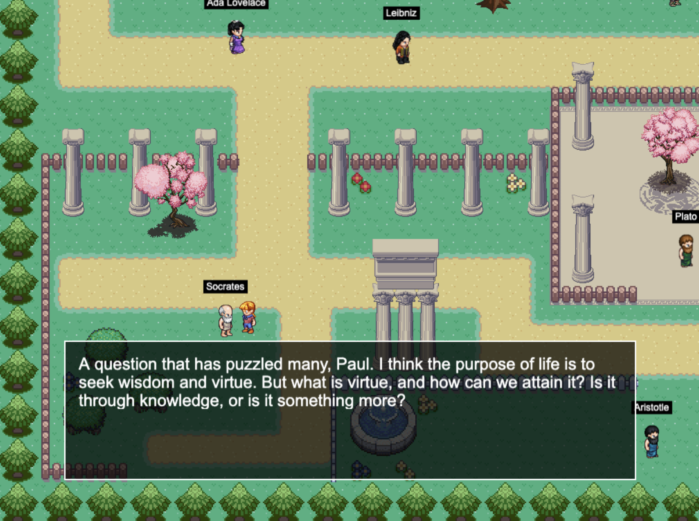
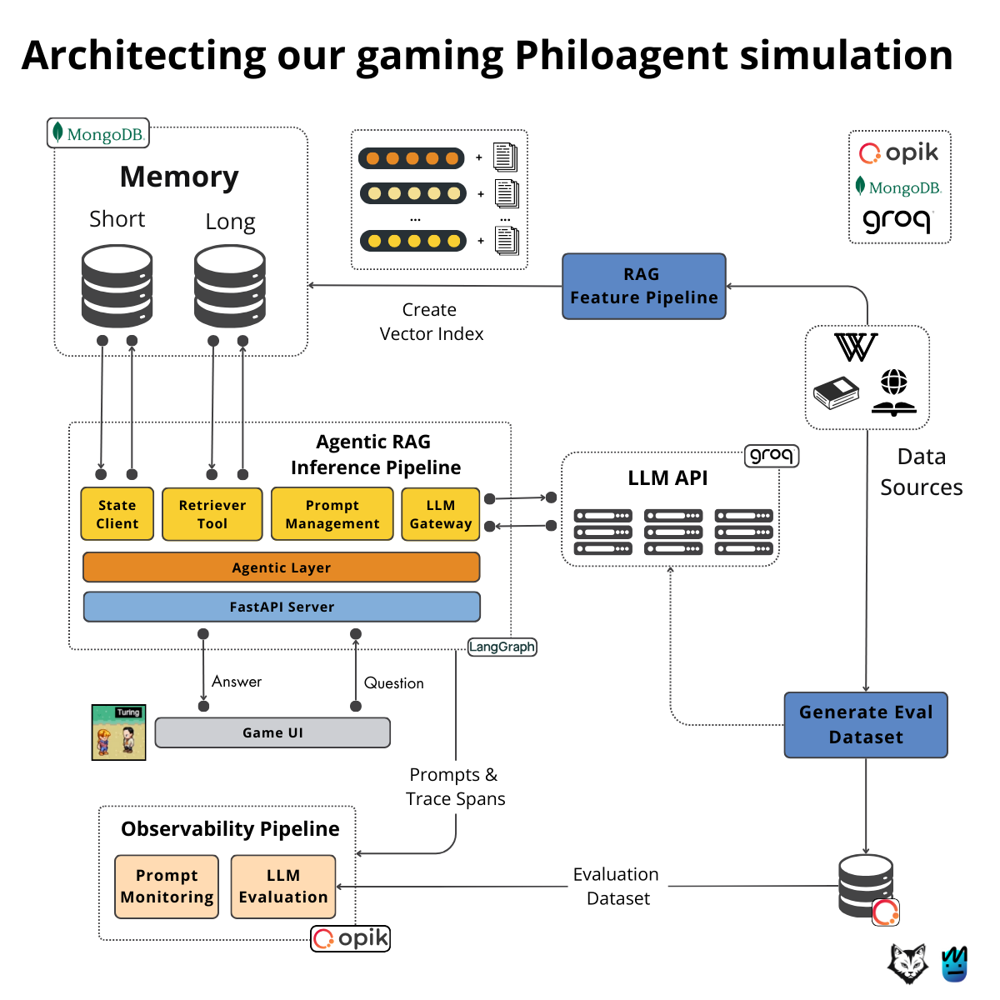

<div align="center">
  
  <h1>PhiloAgents</h1>
  <p>An agentic RAG simulation engine that brings historical philosophers to life as AI-powered game characters.</p>

  <p>
    
    
    
    
    
    
    
  </p>
</div>

<br/>

<p align="center">
  
</p>

## What Is This?

PhiloAgents is an interactive game where you walk around a pixel-art world and have real conversations with AI-powered philosophers. Each character is backed by an **agentic RAG pipeline** — they retrieve knowledge from their own writings and history, reason about your questions, and respond in character.

It's not a chatbot wrapper. It's a full production-grade system: LangGraph agent orchestration, MongoDB for both short-term (conversation state) and long-term (vector) memory, real-time streaming via WebSockets, and LLMOps observability with Opik.

### Characters

The simulation features **14 thinkers** spanning classical philosophy, literature, mathematics, and computer science:

| Character | Known For |
|-----------|-----------|
| **Socrates** | Socratic method, relentless questioning |
| **Plato** | Theory of Forms, the Cave allegory |
| **Aristotle** | Logic, systematic categorization |
| **René Descartes** | Cartesian doubt, "Cogito ergo sum" |
| **Gottfried Leibniz** | Calculus, universal computation |
| **Ada Lovelace** | First computer programmer, creativity vs. calculation |
| **Alan Turing** | Turing Test, computational theory of mind |
| **Noam Chomsky** | Universal grammar, AI skepticism |
| **John Searle** | Chinese Room argument |
| **Daniel Dennett** | Consciousness as emergent process |
| **Niccolò Machiavelli** ✦ | Power dynamics, political realism |
| **Fyodor Dostoevsky** ✦ | Psychology, moral complexity, suffering |
| **Franz Kafka** ✦ | Existential alienation, bureaucratic absurdity |
| **Friedrich Nietzsche** ✦ | Will to power, revaluation of values |

> ✦ Characters I added to the original roster.

## Architecture

<p align="center">
  
</p>

The system is composed of three pipelines:

**1. RAG Feature Pipeline** — Extracts knowledge from Wikipedia and the Stanford Encyclopedia of Philosophy, chunks and embeds documents, and stores them in MongoDB Atlas with hybrid (vector + full-text) search indexes.

**2. Agentic RAG Inference Pipeline** — A LangGraph workflow that orchestrates the conversation:
  - `conversation_node` — The LLM generates an in-character response using the philosopher's prompt card
  - `retrieve_philosopher_context` — A tool node that performs hybrid search over the philosopher's knowledge base
  - `summarize_context_node` — Condenses retrieved context to stay within token limits
  - `connector_node` + `summarize_conversation_node` — Manages conversation history via rolling summaries

**3. Observability Pipeline** — Opik traces every LLM call, prompt version, and evaluation run.

### Key Design Decisions

- **Agent decides when to retrieve** — The LLM is bound with a retriever tool and uses `tools_condition` to decide whether to fetch external context or answer from its prompt card alone
- **Dual memory system** — Short-term memory (LangGraph state checkpointed to MongoDB) keeps conversation context; long-term memory (MongoDB Atlas Vector Search) stores the philosopher's knowledge
- **Streaming over WebSockets** — Responses are streamed chunk-by-chunk to the game UI for a natural conversation feel
- **Conversation summarization** — After 30 messages, a summary is generated and older messages are pruned to control context window size

## Tech Stack

| Layer | Technology |
|-------|-----------|
| Agent Orchestration | LangGraph, LangChain |
| LLM Inference | Groq (Llama 3.3 70B) |
| Vector Store & Memory | MongoDB Atlas (hybrid search) |
| Embeddings | sentence-transformers/all-MiniLM-L6-v2 |
| API | FastAPI + WebSockets |
| LLMOps | Opik (tracing, prompt versioning, evaluation) |
| Game UI | Phaser.js (JavaScript) |
| Infrastructure | Docker Compose |
| Python Tooling | uv, ruff, pytest |

## Project Structure

```
.
├── philoagents-api/          # Backend: agents, RAG, API, evaluation
│   ├── src/philoagents/
│   │   ├── application/      # Conversation service, RAG, data extraction, evaluation
│   │   ├── domain/           # Philosopher models, prompt cards, factory
│   │   └── infrastructure/   # FastAPI server, MongoDB clients, Opik utils
│   ├── tools/                # CLI scripts (create memory, evaluate, etc.)
│   └── tests/
├── philoagents-ui/           # Frontend: Phaser.js pixel-art game
├── docker-compose.yml        # MongoDB Atlas + API + UI
└── Makefile                  # Orchestration commands
```

## Getting Started

### Prerequisites

- [Docker](https://www.docker.com/) and Docker Compose
- A [Groq API key](https://console.groq.com/) (free tier available)
- (Optional) OpenAI API key — only needed for LLM-as-a-judge evaluation
- (Optional) Comet/Opik API key — for prompt monitoring and tracing

### Setup

1. **Clone the repo**
   ```bash
   git clone https://github.com/shrikantnaidu/philoagents.git
   cd philoagents
   ```

2. **Configure environment variables**
   ```bash
   cp philoagents-api/.env.example philoagents-api/.env
   # Edit .env and add your GROQ_API_KEY (required)
   ```

3. **Build and start the infrastructure**
   ```bash
   make infrastructure-up
   ```

4. **Populate the philosophers' long-term memory**
   ```bash
   make create-long-term-memory
   ```

5. **Open the game**

   Navigate to `http://localhost:8080` in your browser. Walk up to a philosopher and start a conversation.

### Other Commands

| Command | Description |
|---------|-------------|
| `make call-agent` | Test the agent directly from CLI |
| `make create-long-term-memory` | Extract and index philosopher knowledge |
| `make delete-long-term-memory` | Clear the vector store |
| `make generate-evaluation-dataset` | Generate synthetic eval data |
| `make evaluate-agent` | Run LLM-as-a-judge evaluation |
| `make infrastructure-stop` | Stop all containers |

## Attribution

This project is a fork of the [PhiloAgents Course](https://github.com/neural-maze/philoagents-course) by [Paul Iusztin](https://github.com/iusztinpaul) (Decoding ML) and [Miguel Otero Pedrido](https://github.com/MichaelisTrofficus) (The Neural Maze). The original course was built in collaboration with MongoDB, Opik, and Groq.

**What I changed:** Extended the character roster with four new philosophers (Machiavelli, Dostoevsky, Kafka, Nietzsche) — each with custom perspectives, conversation styles, and knowledge bases tailored to their views on AI and technology.

## License

This project is licensed under the MIT License.
